#5S.cov.RNA-Seq.png
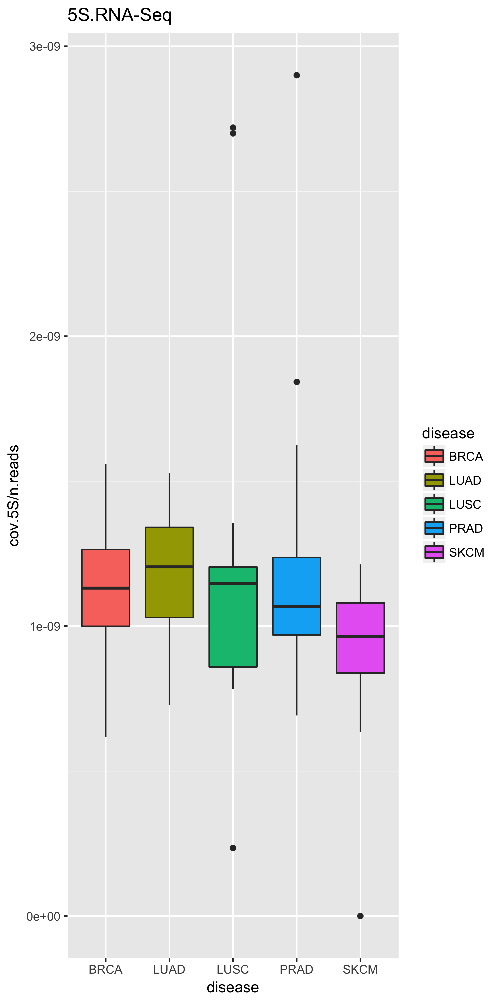
#5S.cov.clinical_data_pathology_T_stage.RNA-Seq.png
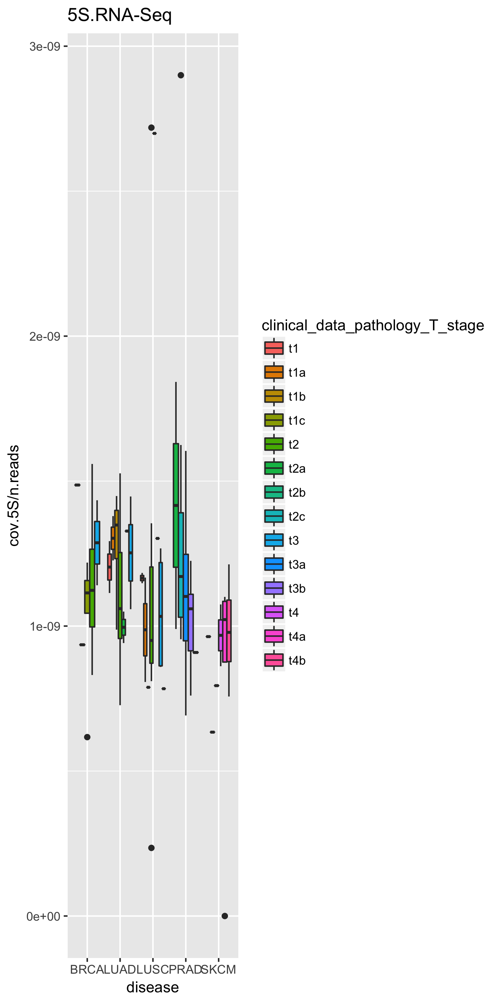
#5S.cov.clinical_data_pathology_T_stage.png
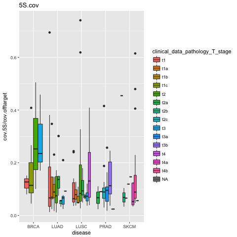
#5S.cov.png
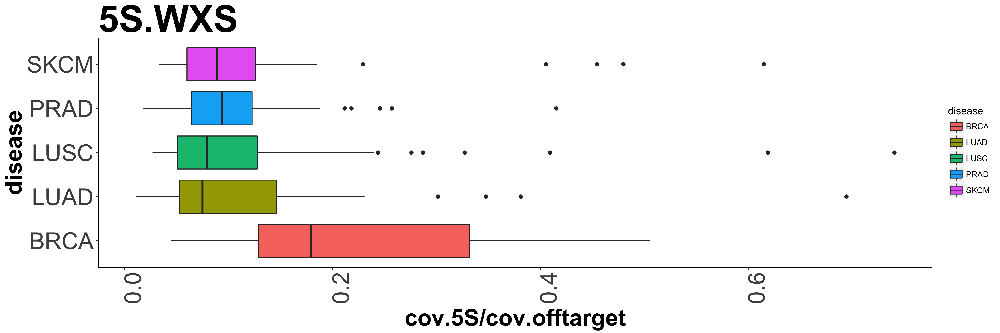
#MT.cov.RNA-Seq.png
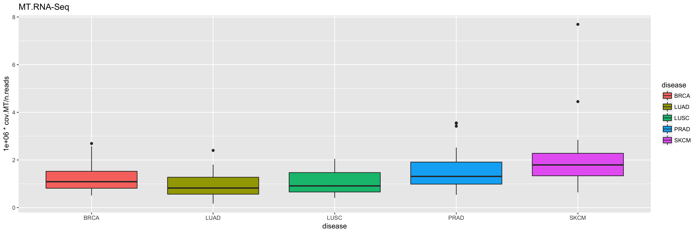
#MT.cov.clinical_data_pathology_T_stage.RNA-Seq.png
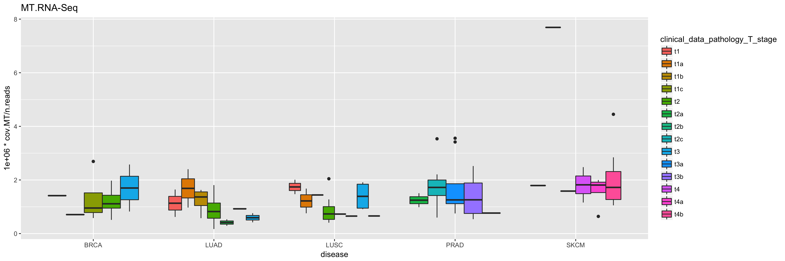
#MT.cov.clinical_data_pathology_T_stage.png
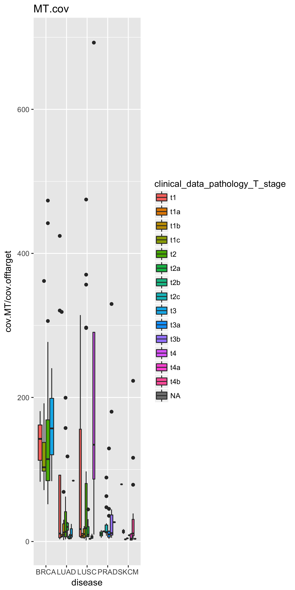
#MT.cov.png
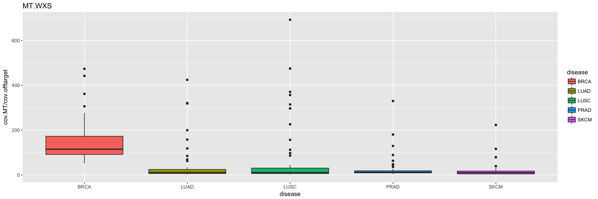
#offtarget.cov.clinical_data_pathology_T_stage.png
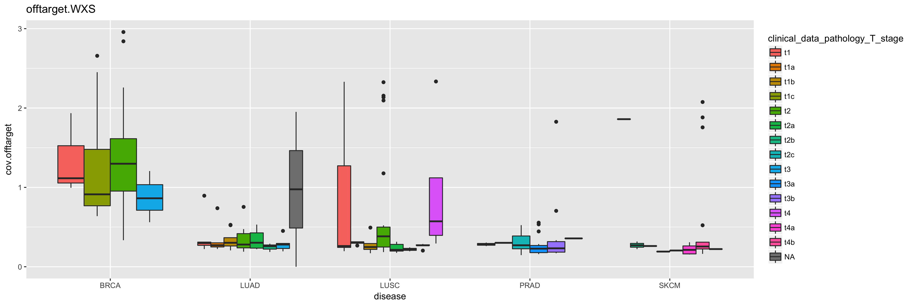
#offtarget.cov.png
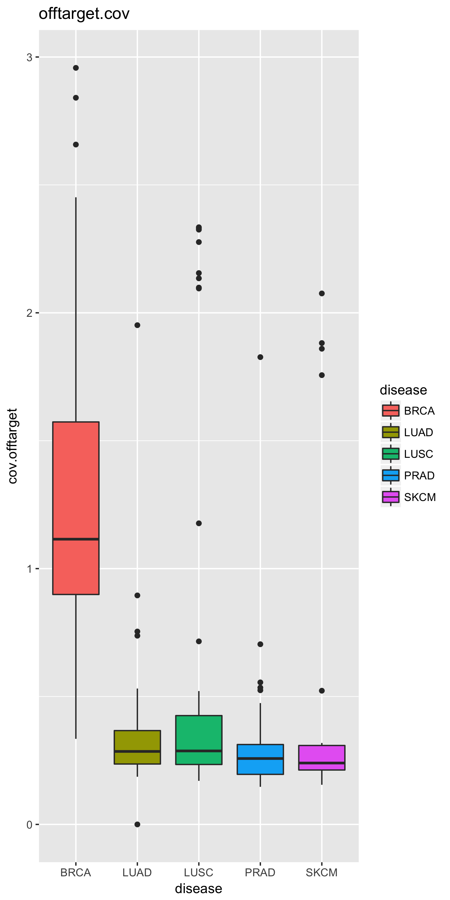
#rDNA.cov.RNA-Seq.png
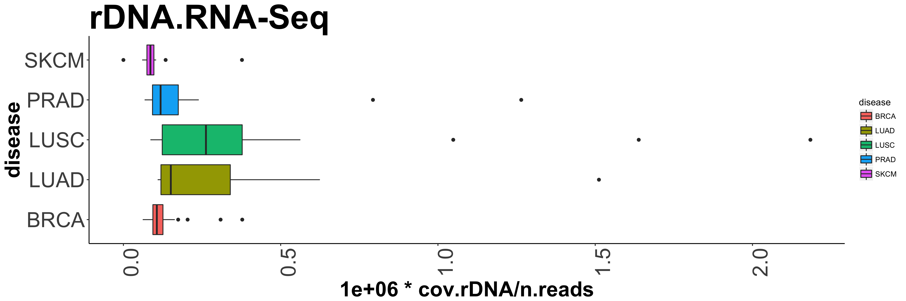
#rDNA.cov.clinical_data_pathology_T_stage.RNA-Seq.png
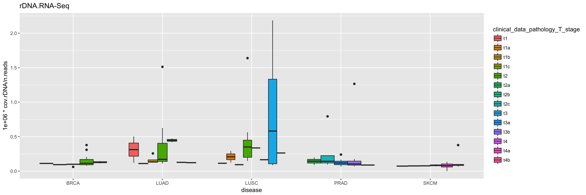
#rDNA.cov.clinical_data_pathology_T_stage.png
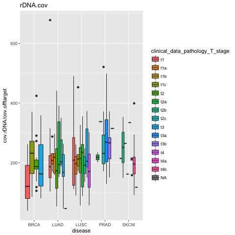
#rDNA.cov.png

#total.RNA-Seq.png
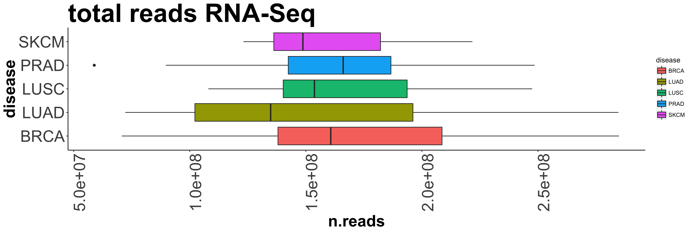
